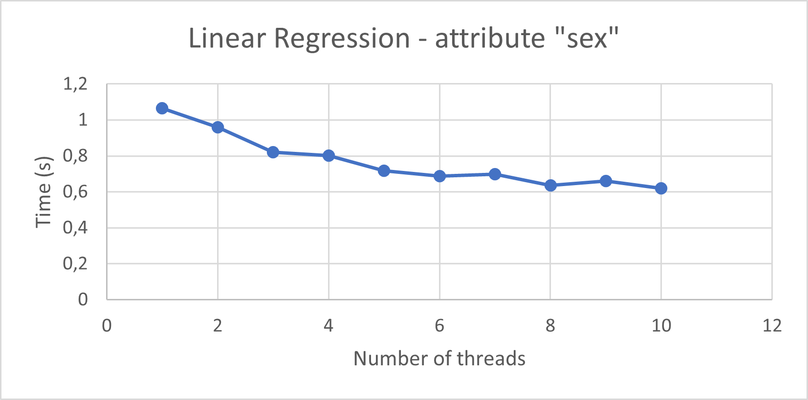
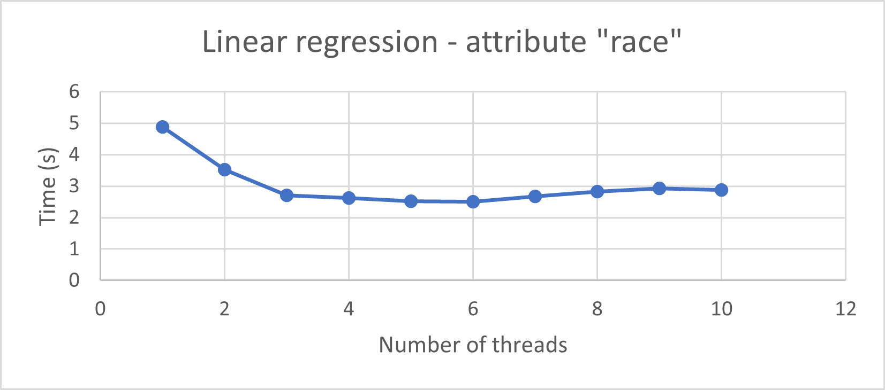
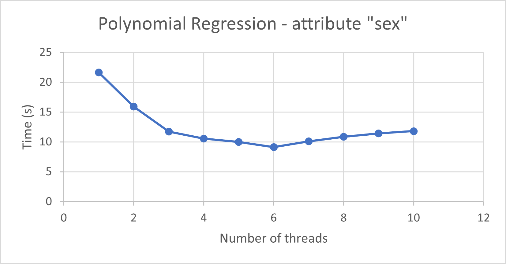
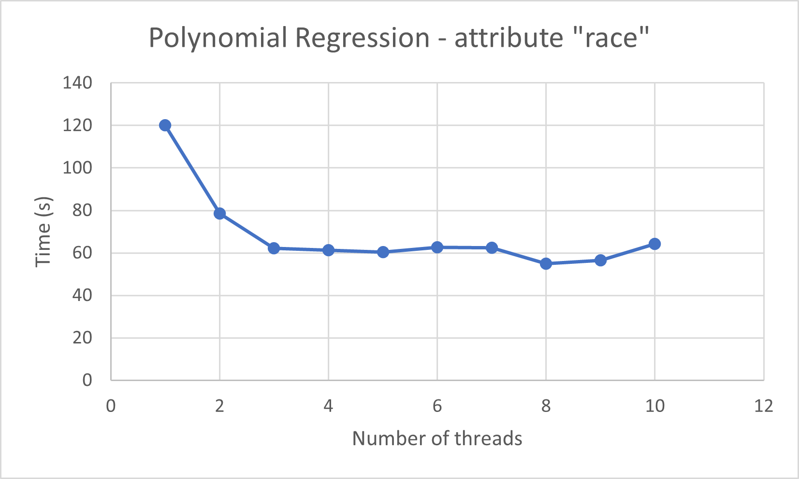

#  Implementation of alternation functions in C++ for detection and evaluation of bias in ML
Authors: Ilaria Pilo, Davide Porello, Marco Porro  
Date: 04/07/2022  
................................something................................

## Table of contents
- [Introduction](#introduction)
- [Project design](#project-design)
- [Experimental results](#experimental-results)
- [Conclusion](#conclusion)
- [References](#references)

## Introduction
................................something................................

## Project design
................................something................................
### Preprocessing
The preprocessing is highly inspired by the paper, infact we have reduced the dataset (files `dataset/censun-income.data` and `census-income.test`) from 300000 to 15000 approximately.
We have selected a set of 10 attributes that, for us, are strictly related to the "wage" (that is the label).
We have filtered each categorial attributes (all of our attributes are categorial except the age) specifying part of the possible categorial values (see file `dataset/censun-income.names`).
The class `ClearedDataset` loads the dataset in an Eigen::MatrixXf and the labels in an Eigen::vectorXf taking the values from the file `dataset/cleaned-dataset.txt`, if the file is not present yes it creates the file using the class `Dataset`.
Attributes in `ClearedDataset`: age, education, marital stat, major industry code, major occupation code, race, sex, member of a labor union, full or part time employment stat and citizenship.
### Machine Learning models
Unluckily, C++ does not appear to have any intuitive and portable machine learning library. For this reason, after long searches and attempts, we decided to develop our own models.  
Since [[1]](#references) uses machine learning to predict the wage (i.e., a continuous value), we developed two different regression algorithms:
- Linear regression (class `LinearRegression`)
- Polynomial regression (class `PolynomialRegression`)

Both classes extend the abstract class `ModelML`, which provides a general interface. This structure allows functions to use a generic model, so that we can easily select it in the program configuration phase.

Since the aim of the project was not to develop a machine learning algorithm, we decided to use a fully-sequential approach, having as core the Eigen library [[3]](#references). Eigen is a powerful C++ library supporting linear algebra operations; it is focused on versatility, performance and reliability.
#### Linear regression
Linear regression consists in interpreting pairs (sample, value) as points, and fitting them by means of a linear hyper-plane using the least square approach.  
Data is first centered, so that the mean of each feature is 0, and then fed to an Eigen solver based on Complete Orthogonal Decomposition. We chose this algorithm since it appears to be the best tradeoff between speed and reliability, working well also with matrices which are not full rank (information about other possible approaches can be found [here](https://eigen.tuxfamily.org/dox/group__LeastSquares.html#:~:text=An%20overdetermined%20system%20of%20equations,the%20Euclidean%20norm%20is%20used)). The result of this computation will be directly used to predict the value of unknown samples.
#### Polynomial regression
Polynomial regression is simply a special type of linear regression, where features are expanded considering all their possible combinations up to a specified degree. For example, if a sample has features [a, b, c] and the degree is 2, then the feature expansion will result in [1, a, b, c, ab, ac, ba, a2, b2, c2].  
For this reason, the `PolynomialRegression` class simply performs the feature expansion by means of a recursive function, and then calls the methods of `LinearRegression`.  
Notice that the computation of feature expansion is by definition a pretty expensive task. Moreover, since it increases the number of dimensions, it also increases the complexity of training and using the model. As a consequence, the application supports degrees only up to 4.
### Alternation function
................................something................................
### KL divergence computation
The KL divergence is computed by a function which partially uses Eigen utilities to compute mean and standard deviation. The KL divergence computation is not an expensive task (cost O(N), where N is the number of samples in the evaluation set). For this reason, we chose to exploit parallelization techniques at higher levels (e.g., we perform KL divergence in parallel for different 10-fold iterations).
## Experimental results
We have measured the performances of the program (excluding the dataset loading and the plots creation) with the linear or polynomial regression and the attributes 'sex' or 'race' as PBA (as the paper says).

## Conclusion
................................something................................

## References
[1] 2021, _Detection and Evaluation of Machine Learning Bias._ Alelyani, Salem. Applied Sciences 11, no. 14: 6271. https://doi.org/10.3390/app11146271  
[2] _Census-Income (KDD) Data Set_. Machine Learning Repository. https://archive.ics.uci.edu/ml/datasets/Census-Income+%28KDD%29  
[3] _Eigen v3_. https://eigen.tuxfamily.org/index.php?title=Main_Page