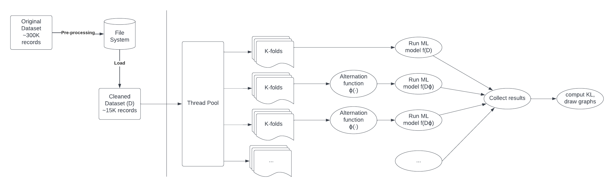

#  Implementation of alternation functions in C++ for detection and evaluation of bias in ML
Authors: Ilaria Pilo, Davide Porello, Marco Porro  
Date: 04/07/2022  
................................something................................

## Table of contents
- [Introduction](#introduction)
- [Project design](#project-design)
- [Experimental results](#experimental-results)
- [Conclusion](#conclusion)
- [References](#references)

## Introduction
The goal of the project is to implement the code relative to the _Detection and Evaluation of Machine Learning Bias_[[1]](#references) research paper in C++, and measure its performance.

## Project design
Given the starting dataset D[[2]](#references), the paper illustrates the following pipeline:
1. Train the model f(·) on the dataset D. 
2. Predict the class label for each data point in f(D) → ˆy. 
3. Apply the alternation function on the gender attribute ϕ(D) → Dϕ. 
4. Train the model f(·) on the alternative dataset Dϕ.
5. Predict the alternative predicted label f(Dϕ) → ˆyϕ.

To improve the performance of this operations, we decided to use parallelization, in the form of a thread pool, to compute concurrently the predictions of the machine learning model.

### Preprocessing
The preprocessing is highly inspired by the paper, infact we have reduced the dataset (files `dataset/censun-income.data` and `census-income.test`) from 300000 to 15000 approximately.
We have selected a set of 10 attributes that, for us, are strictly related to the "wage" (that is the label).
We have filtered each categorial attributes (all of our attributes are categorial except the age) specifying part of the possible categorial values (see file `dataset/censun-income.names`).
The class `ClearedDataset` loads the dataset in an Eigen::MatrixXf and the labels in an Eigen::vectorXf taking the values from the file `dataset/cleaned-dataset.txt`, if the file is not present yes it creates the file using the class `Dataset`.
Attributes in `ClearedDataset`: age, education, marital stat, major industry code, major occupation code, race, sex, member of a labor union, full or part time employment stat and citizenship.

### K-fold and parallelization
As indicated in the paper, the model predictions must be evaluated using K-fold, with K=10. Additionally, this process must be repeated multiple times, on the original dataset and the alternated one(s).
Computing the model predictions is the most expensive task of the project, therefore we decided to parallelize it.
The simplest approach is to create a thread for each dataset, and then create K threads for each fold. In each of these threads, the train and test sets are identified, the alternation function is computed on the test set (if needed), then the threads returns the mean and variance of the predictions inside a future.
To compute the KL and draw the graph we don't need to return the entire prediction vector.

Instead, we decided to create more refined solution, using a thread pool of N worker threads.
For each fold of each dataset, a new task is created and enqueued in the thread pool. This decreses the memory requirements of the program, especially when detecting the bias of a PBA with many categories, and allows a better control of the parallelization.
If only 1 thread is created in the thread pool, the program is essentially sequential (plus a small overhead from the thread management), which allows us to measure the performance benefits of the parallelization.

Other kinds of parallelization can be proposed. For example, the alternation function or the variance calculations can be splitted in different threads, but this does not improves the performance, since they are not appreciably expensive, and the program already surpasses the number of hardware threads on any consumer machine.
### Machine Learning models
Unluckily, C++ does not appear to have any intuitive and portable machine learning library. For this reason, after long searches and attempts, we decided to develop our own models.  
Since [[1]](#references) uses machine learning to predict the wage (i.e., a continuous value), we developed two different regression algorithms:
- Linear regression (class `LinearRegression`)
- Polynomial regression (class `PolynomialRegression`)

Both classes extend the abstract class `ModelML`, which provides a general interface. This structure allows functions to use a generic model, so that we can easily select it in the program configuration phase.

Since the aim of the project was not to develop a machine learning algorithm, we decided to use a fully-sequential approach, having as core the Eigen library [[3]](#references). Eigen is a powerful C++ library supporting linear algebra operations; it is focused on versatility, performance and reliability.
#### Linear regression
Linear regression consists in interpreting pairs (sample, value) as points, and fitting them by means of a linear hyper-plane using the least square approach.  
Data is first centered, so that the mean of each feature is 0, and then fed to an Eigen solver based on Complete Orthogonal Decomposition. We chose this algorithm since it appears to be the best tradeoff between speed and reliability, working well also with matrices which are not full rank (information about other possible approaches can be found [here](https://eigen.tuxfamily.org/dox/group__LeastSquares.html#:~:text=An%20overdetermined%20system%20of%20equations,the%20Euclidean%20norm%20is%20used)). The result of this computation will be directly used to predict the value of unknown samples.
#### Polynomial regression
Polynomial regression is simply a special type of linear regression, where features are expanded considering all their possible combinations up to a specified degree. For example, if a sample has features [a, b, c] and the degree is 2, then the feature expansion will result in [1, a, b, c, ab, ac, ba, a2, b2, c2].  
For this reason, the `PolynomialRegression` class simply performs the feature expansion by means of a recursive function, and then calls the methods of `LinearRegression`.  
Notice that the computation of feature expansion is by definition a pretty expensive task. Moreover, since it increases the number of dimensions, it also increases the complexity of training and using the model. As a consequence, the application supports degrees only up to 4.
### Alternation function
The alternation function is a simple function that switches two categories of an attribute on a dataset. Since the time needed to compute this function is negligible (under 1 ms), it is computed sequentially (using multiple threads would just be an additional overhead).
### KL divergence computation
The KL divergence is computed by a function which partially uses Eigen utilities to compute mean and standard deviation. The KL divergence computation is not an expensive task (cost O(N), where N is the number of samples in the evaluation set). 
However, most of this cost compes from the calculation of the mean and variance of the evaluated sets. In our design we computed these metrics directly inside the thread pool (threfore taking advantege of the parallelization), and in the post process section at the end, the code just computes the final formula, which requires less than a millisecond to compute.
## Experimental results
We have measured the performances of the program (excluding the dataset loading and the plots creation) with the linear or polynomial regression and the attributes 'sex' or 'race' as PBA (as the paper says).

## Conclusion
After the development of the code, we can make some considerations:
- The paper states that the alternation function is computed on the dataset D. This is not precise, as with this approach the code would not produce appreciable results. The alternation function must be computed at each iteration on the test fold only
- As seen in the alternation graphs, our model predicts wages that are considerably different with respect to the paper's findings. Upon closer inspection, our results seem to be correct, as the average wage in our dataset is about 1800. 
  A partial explanation for this behavious is that the difference might be caused by a different preprocessing of the original dataset.

## References
[1] 2021, _Detection and Evaluation of Machine Learning Bias._ Alelyani, Salem. Applied Sciences 11, no. 14: 6271. https://doi.org/10.3390/app11146271  
[2] _Census-Income (KDD) Data Set_. Machine Learning Repository. https://archive.ics.uci.edu/ml/datasets/Census-Income+%28KDD%29  
[3] _Eigen v3_. https://eigen.tuxfamily.org/index.php?title=Main_Page